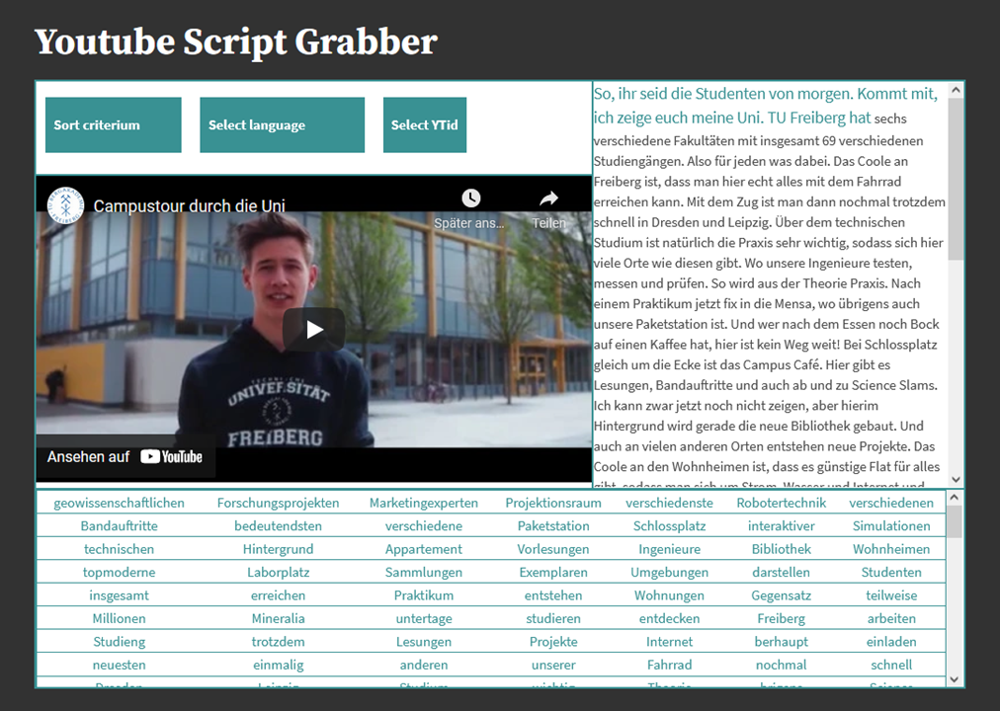

<!--

author:   Mark Jacob
email:    mark.jacob@iuz.tu-freiberg.de
version:  0.0.2
language: de
narrator: UK English Female

import:   https://raw.githubusercontent.com/kaptn-seebar/english-lia/main/grabber/grabber.md
          https://github.com/LiaTemplates/AVR8js/main/README.md#10
          https://raw.githubusercontent.com/liascript-templates/plantUML/master/README.md
          https://github.com/liascript/CodeRunner

icon:     https://upload.wikimedia.org/wikipedia/commons/d/de/Logo_TU_Bergakademie_Freiberg.svg

-->


[](https://liascript.github.io/course/?https://raw.githubusercontent.com/markjjacob/df-review/main/README.md#1)

# Digital Fellows - Summary 2021

This is a brief overview of the work carried out by the team of Professor Sebastian Zug and Dr Mark Jacob in the framework of a tandem [Digital Fellowship](https://bildungsportal.sachsen.de/portal/parentpage/projekte/digital-fellowships/) awarded by the SMWK (Saxon Ministry of Science, Culture and Tourism).

<!--data-type="none"-->
| Parameter  | Value      |
| :--------- | :--------- |
| Start      | 01.07.2020 |
| End        | 31.12.2021 |
| Duration   | 18 months  |
| Amount     | €25,000    |

For an overview of all Digital Fellows in Saxony from 2019 to 2022, please click [here](https://bildungsportal.sachsen.de/portal/parentpage/projekte/digital-fellowships/fellows/).

## Learning materials and tools

Collection of online ...

1. learning materials (programming content)
2. instructions for presenting scientific content (good and bad examples)
3. tools

... to prepare student presentations (4.)

We focused the development for this project on [LiaScript](https://liascript.github.io/).

### Learning materials

**Embedded Coding Environment**

<div>
<wokwi-led color="red" pin="13" port="B"></wokwi-led>
</div>

```cpp helloWorldinArduino.cpp
void setup() {
  pinMode(LED_BUILTIN, OUTPUT);
}

void loop() {
  digitalWrite(LED_BUILTIN, HIGH);
  delay(1000);
  digitalWrite(LED_BUILTIN, LOW);
  delay(1000);
}
```
@AVR8js.sketch


**Programming Environment**

```csharp  Coderunner.cs9
using System;
using System.Collections.Generic;
using System.Collections;
using System.Linq;
using System.Text;

int n;
Console.Write("Number of primes: ");
n = int.Parse(Console.ReadLine());

ArrayList primes = new ArrayList();
primes.Add(2);

for(int i = 3; primes.Count < n; i++) {
	bool isPrime = true;
	foreach(int num in primes) isPrime &= i % num != 0;
	if(isPrime) primes.Add(i);
}

Console.Write("Primes: ");
foreach(int prime in primes) Console.Write($" {prime}");
```
```xml   -myproject.csproj
<Project Sdk="Microsoft.NET.Sdk">
  <PropertyGroup>
    <OutputType>Exe</OutputType>
    <TargetFramework>net5.0</TargetFramework>
  </PropertyGroup>
</Project>
```
@LIA.eval(`["Program.cs", "project.csproj"]`, `dotnet build -nologo`, `dotnet run -nologo`)


**Complete course materials for secific topics**

??[DigitalImageFilters](https://liascript.github.io/course/?https://raw.githubusercontent.com/HueblerPatricia/LiaScriptTUBAF/main/DigitalImageFilters.md)


### Instructions for presenting scientific

> **1. Introducing yourself**

<iframe src="https://video.tu-freiberg.de/media/embed?key=4349372d9d69e2415729b1a3a2fab941&width=560&height=315&autoplay=false&autolightsoff=false&loop=false&chapters=false&related=false&responsive=false&t=0" data-src="" class="iframeLoaded" width="560" height="315" frameborder="0" allowfullscreen="allowfullscreen" allowtransparency="true" scrolling="no" aria-label="media embed code" style=""></iframe>

> **2. Introducing your topic**

<iframe src="https://video.tu-freiberg.de/media/embed?key=5978d19af08232dfa88c03cb7ad2a14f&width=560&height=315&autoplay=false&autolightsoff=false&loop=false&chapters=false&related=false&responsive=false&t=0" data-src="" class="iframeLoaded" width="560" height="315" frameborder="0" allowfullscreen="allowfullscreen" allowtransparency="true" scrolling="no" aria-label="media embed code" style=""></iframe>

> **3. Synonyms**

<iframe src="https://video.tu-freiberg.de/media/embed?key=c2230053b26249e624c2476f8c7a409a&width=560&height=315&autoplay=false&autolightsoff=false&loop=false&chapters=false&related=false&responsive=false&t=0" data-src="" class="iframeLoaded" width="560" height="315" frameborder="0" allowfullscreen="allowfullscreen" allowtransparency="true" scrolling="no" aria-label="media embed code" style=""></iframe>

> **4. Useful phrases**

<iframe src="https://video.tu-freiberg.de/media/embed?key=3bebb19a2d1f9c8fa2a6c4d338134561&width=560&height=315&autoplay=false&autolightsoff=false&loop=false&chapters=false&related=false&responsive=false&t=0" data-src="" class="iframeLoaded" width="560" height="315" frameborder="0" allowfullscreen="allowfullscreen" allowtransparency="true" scrolling="no" aria-label="media embed code" style=""></iframe>

> **5. Nerves**

<iframe src="https://video.tu-freiberg.de/media/embed?key=89bf38bd9dc6eb725746648b05e67c75&width=560&height=315&autoplay=false&autolightsoff=false&loop=false&chapters=false&related=false&responsive=false&t=0" data-src="" class="iframeLoaded" width="560" height="315" frameborder="0" allowfullscreen="allowfullscreen" allowtransparency="true" scrolling="no" aria-label="media embed code" style=""></iframe>

> **6.1 Non-verbal communication**

<iframe src="https://video.tu-freiberg.de/media/embed?key=d5b08cd5a5b7ffcd076acfcf29fa1b30&width=560&height=315&autoplay=false&autolightsoff=false&loop=false&chapters=false&related=false&responsive=false&t=0" data-src="" class="iframeLoaded" width="560" height="315" frameborder="0" allowfullscreen="allowfullscreen" allowtransparency="true" scrolling="no" aria-label="media embed code" style=""></iframe>

> **6.2 Non-verbal communication**

<iframe src="https://video.tu-freiberg.de/media/embed?key=892ed954c1bb2fc53f5a6efaf97f0e4f&width=560&height=315&autoplay=false&autolightsoff=false&loop=false&chapters=false&related=false&responsive=false&t=0" data-src="" class="iframeLoaded" width="560" height="315" frameborder="0" allowfullscreen="allowfullscreen" allowtransparency="true" scrolling="no" aria-label="media embed code" style=""></iframe>

> **7. Conclusion**

<iframe src="https://video.tu-freiberg.de/media/embed?key=04a93eca656810677743ff2488fda44b&width=560&height=315&autoplay=false&autolightsoff=false&loop=false&chapters=false&related=false&responsive=false&t=0" data-src="" class="iframeLoaded" width="560" height="315" frameborder="0" allowfullscreen="allowfullscreen" allowtransparency="true" scrolling="no" aria-label="media embed code" style=""></iframe>

> **8. Questions**

<iframe src="https://video.tu-freiberg.de/media/embed?key=e87b984068e6be6ac2d41d9941e133dd&width=560&height=315&autoplay=false&autolightsoff=false&loop=false&chapters=false&related=false&responsive=false&t=0" data-src="" class="iframeLoaded" width="560" height="315" frameborder="0" allowfullscreen="allowfullscreen" allowtransparency="true" scrolling="no" aria-label="media embed code" style=""></iframe>


### Tools for digital learning

     {{0-1}}
*******************************************************************************

**Image describer**

??[ImageDescriber](https://liascript.github.io/course/?https://raw.githubusercontent.com/markjjacob/EnglishImageDescriber/main/LiaScriptImageDescriber/ImageDescriber.md)

[StudentDescription](https://github.com/markjjacob/df-review/blob/main/Images/yannic_reviewed_by_chris.pdf)

*******************************************************************************

       {{1-2}}
*******************************************************************************

**ONYX markdown converter**


<!-- class="translate"-->
``` markdown
What is the correct spelling of H(D)D?

[(X)] hard (**disk**) drive
[( )] hard (**desk**) drive
[(x)] hard (**disc**) drive
```


What is the correct spelling of H(D)D?

[(X)] hard (**disk**) drive
[( )] hard (**desk**) drive
[(x)] hard (**disc**) drive

> Take a closer view to LiaScript quizzes in the [Documentation](https://liascript.github.io/course/?https://raw.githubusercontent.com/LiaScript/docs/master/README.md#59)

??[OnyxConverter](https://gelbeforelle.github.io/SHK-Tools/onyx-gen.html)

*******************************************************************************

       {{2-3}}
*******************************************************************************

**Video analysis tool**



*******************************************************************************

## Presentations

??[ExamplePresentation](https://liascript.github.io/course/?https://raw.githubusercontent.com/BerndSchmecka/lia-presentation/main/presentation.md#1)


## Student feedback


